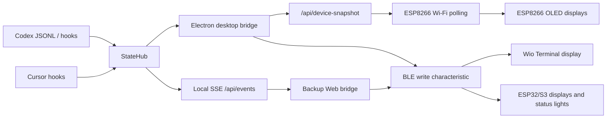

# Vibe Pet Hardware Protocol

BLE hardware exposes one GATT service and one writable characteristic. ESP8266 hardware uses the same payload shape through Wi-Fi polling because ESP8266 does not provide BLE.

| Field | Value |
| --- | --- |
| Service UUID | `7b71f91a-3c7b-4c3b-9f2d-2dbdccd5c001` |
| State characteristic UUID | `7b71f91a-3c7b-4c3b-9f2d-2dbdccd5c002` |
| Device name prefixes | `VibePet-Wio`, `VibePet-ESP-AI`, `VibePet-ESP-Display`, `VibePet-M5`, `VibePet-LILYGO`, `VibePet-Heltec`, `VibePet-WEMOS` |

Desktop and Web bridges also recognize legacy `CodePet-*` prefixes so existing flashed devices can still connect after the project rename.

## Payload

The desktop bridge writes compact UTF-8 JSON:

```json
{
  "v": 1,
  "s": "working",
  "a": "Codex",
  "e": "response_item:function_call",
  "n": 1,
  "m": "vibe-pet",
  "p": "lulu-capybara-2",
  "d": "噜噜",
  "k": "builtin",
  "u": "assets/lulu-capybara.webp",
  "ts": 1781500000000
}
```

| Key | Type | Description |
| --- | --- | --- |
| `v` | number | Protocol version. Currently `1`. |
| `s` | string | Pet state. |
| `a` | string | Agent label, such as `Codex` or `Cursor`. |
| `e` | string | Source event name. |
| `n` | number | Active session count after aggregation. |
| `m` | string | Optional short title or workspace basename. |
| `p` | string | Optional character/persona slug. |
| `d` | string | Optional character/persona display name. |
| `k` | string | Optional character/persona kind. |
| `u` | string | Optional spritesheet URL or asset path. |
| `ts` | number | Desktop timestamp in milliseconds. |

Color display firmware uses `p`, `d`, `k`, and `u` to keep the selected desktop character identity in sync with the hardware renderer. Low-resource OLED devices may render a simplified local character while keeping the same persona name and state animation.

## Wi-Fi Device Snapshot

ESP8266 boards do not support BLE, so display firmware for ESP8266 uses local Wi-Fi polling instead:

```text
GET /api/device-snapshot
```

The response contains the current hardware-facing pet list:

```json
{
  "v": 1,
  "at": 1781500000000,
  "pets": [
    {
      "id": "editor:cursor:/project",
      "title": "vibe-pet",
      "state": "working",
      "agentName": "Cursor",
      "persona": {
        "slug": "lulu-capybara-2",
        "displayName": "噜噜",
        "kind": "builtin",
        "spritesheetUrl": "assets/lulu-capybara.webp"
      },
      "packet": {
        "v": 1,
        "s": "working",
        "a": "Cursor",
        "m": "vibe-pet",
        "p": "lulu-capybara-2",
        "d": "噜噜",
        "k": "builtin",
        "u": "assets/lulu-capybara.webp",
        "ts": 1781500000000
      }
    }
  ]
}
```

## States

Supported states:

```text
idle
thinking
working
typing
building
juggling
attention
notification
error
sweeping
sleeping
```

`permission` and `codex-permission` are normalized to `notification` by the desktop bridge.

## Event Flow



The desktop and backup web bridges are intentionally write-only to the device. They do not expose approval, prompts, tool input, or full transcript content.
